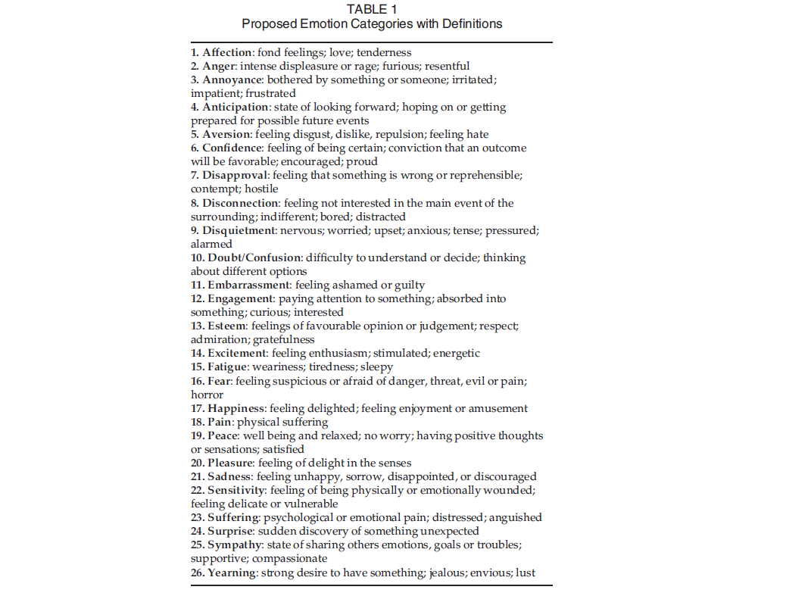
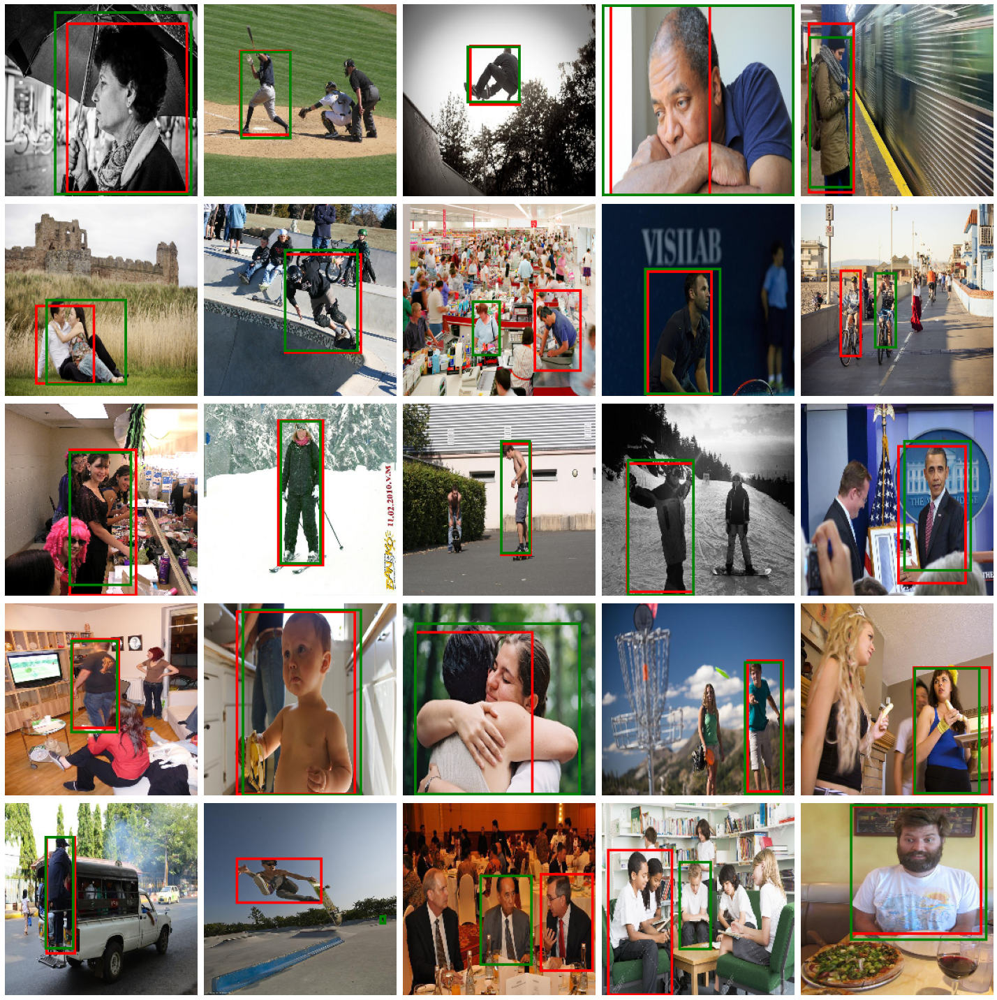
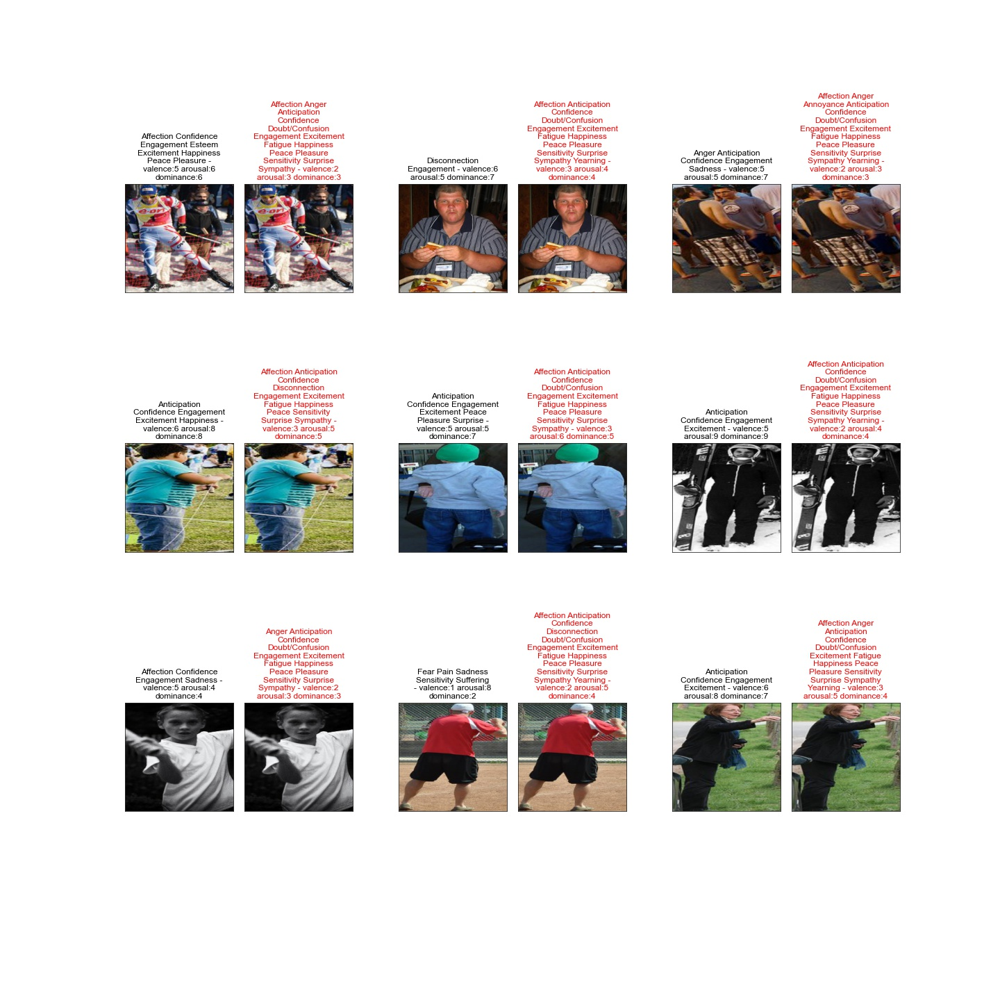

# Emotion Annotation

## Business Understanding
The COVID-19 pandemic has affected numerous lives either directly by falling ill to it, or indirectly through breaking the social bonds that people had before the outbreak. However, the lasting effects of the lockdowns to stave off the pandemic have been more pernicious on the mental state of people. Severing social ties and long time in-house lockdowns have further exacerbated the decline of mental health, especially among [children and adolescents](https://www.ncbi.nlm.nih.gov/pmc/articles/PMC7444649/). While a medical intervention is very important to overcome these health challenges is important, we can also repurpose some of the technology we have for human-computer interaction to identify the telltale signs whenever possible. One of these technologies are chatbots. 

Chatbots usually interact with clients through audio communication and have shown [effective discrimination to understand the state of the humans based on vocal intonation](https://onlinelibrary.wiley.com/doi/abs/10.1111/j.1752-0606.2006.tb01598.x). However, most of the nonverbal communication takes place visually. Therefore, there is a need to develop a chatbot that can understand the emotional state of a person though visual cues.  Although there are datasets that have been trained extensively on identifying emotions based on facial expressions such as [FER 2013]( https://www.kaggle.com/datasets/ananthu017/emotion-detection-fer), body language omitted from analysis, the number of emotions identified are limited (only 7 emotions identified, namely: anger, disgust, fear, happiness, neutral, sadness and surprised) and the emotional states have no interdependence (i.e. a face cannot exhibit happiness and confidence at the same time). Alternatively, [a context-based emotion recognition based on EMOTIC dataset](https://arxiv.org/abs/2003.13401) was used instead, which has a comprehensive list of emotions (as shown in this figure) combined with the degrees of valence, arousal and dominance of a person for a given context. 

Although the wider ambition of this project is to develop a fully-interactive chatbot that can effectively gather one or more of emotional states, coupled natural language processing tools trained on differential diagnoses for [DSM-5 data]( https://www.psychiatry.org/psychiatrists/practice/dsm/educational-resources/dsm-5-fact-sheets), to pick up on signs of mental health, at this stage, the project will be focused on developing a system that can process emotional states. 

## Data Understanding 
The data for this project was developed by [Ronak Kosti or Agata Lapedriza]( http://sunai.uoc.edu/emotic/index.html) and was downloaded from [Graviti]( https://gas.graviti.com/dataset/graviti-315461/Emotic). The details of emotions that are identified in the dataset are shown in the table below, a screen capture from [their paper](https://arxiv.org/abs/2003.13401). 

The data consists of images of varying sizes, the respective bounding boxes of subjects annotated, the emotional states based on the 26 categories and a spectrum of **valence**, **arousal** and **dominance** also referenced as **VAD**. The details of emotions that are identified in the dataset are shown in the table below. The dataset is split into training, validation and test datasets. 

## Modeling 
This project tries to address two problems: the first is bounding box detection to identify humans for a given image/video with will be used as body data for emotion recognition. The second is developing a neural network model that can best fit the discrete emotional states of the subjects. 

For bounding box prediction, 16,981 training, 2,088 validation and 8,189 test images were considered. The reason being that a single image can have multiple individuals and annotation, which leads to redundancy. Some of the annotations appear to be small for object detection. Therefore, the largest bounding box from each image was selected to maximize detection. As for the neural network, a custom Convolutional Neural Network, MobileNet architecture and [Tensorflow’s Single Shot MultiBox Detector (SSD) trained on MobileNet](https://github.com/tensorflow/models/tree/master/research/object_detection) were considered. The models produce regressions of bounding box predictions. Intersection over Union was considered as a metric to evaluate the accuracy of each method. 

Context based emotional detection uses two datasets: the context of an individual, which is the entire image, and the body expression of the person in question. To make effective predictions, Siamese networks that are separately trained on both images that were concatenated and fed to an array of smaller convolutional layers. For the core of Siamese networks, a custome Convolutional Neural Network, VGG16, VGG19 and ResNet models were considered. As an alternative, a PyTorch implementation by [Abhishek Tandon](https://github.com/Tandon-A/emotic) was trained and converted to Keras using [ONNX]( https://onnx.ai/). The predictions were then compared for different types of metrics.

## Results 
Bounding box prediction produced with 53.2% intersection over union boxes compared to the box labeling. Here are 25 randomly chosen pictures showing the precision of predicting a person in an image. 

The emotion labeling was able to predict 60% of the emotions correctly. As can be seen in 9 randomly selected images below, the model produces redundant annotations to most images. 


## Conclusion
The bounding box detection worked effectively. This comes at no surprise as the model that was chosen was trained on a larger dataset and only predictions on validation and test datasets were conducted. The final model had an accuracy was able to annotate the correct emotion on 60% of the test images. The accuracy is significantly lower than that which has been reported by the creators of the dataset. The multi-labeling of emotions, though enriches the data, penalizes the performance of the model. 

## Next Steps
The next steps in the model development will be to finetune the models to improve predictions. Afterwards, the best model can be deployed as a computer vision program as part of the chatbot. In addition, creating a natural language processing deep neural network model or a transformer model will be the next step to provide interactivity. The training process will also include modeling on a differential diagnosis for mental health.  

## For More Information

See the full analysis in the [Jupyter Notebook](./index.ipynb) or review this [presentation](./presentation.pdf).

## Repository Structure

```
├── nb_images/
├── data/
├── models/
├── preds/
├── README.md
├── presentation.pdf
└── index.ipynb
